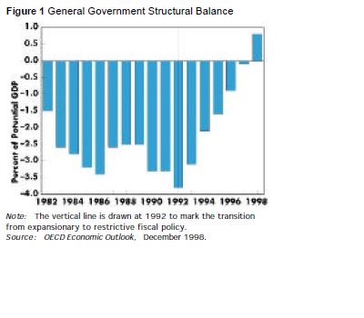
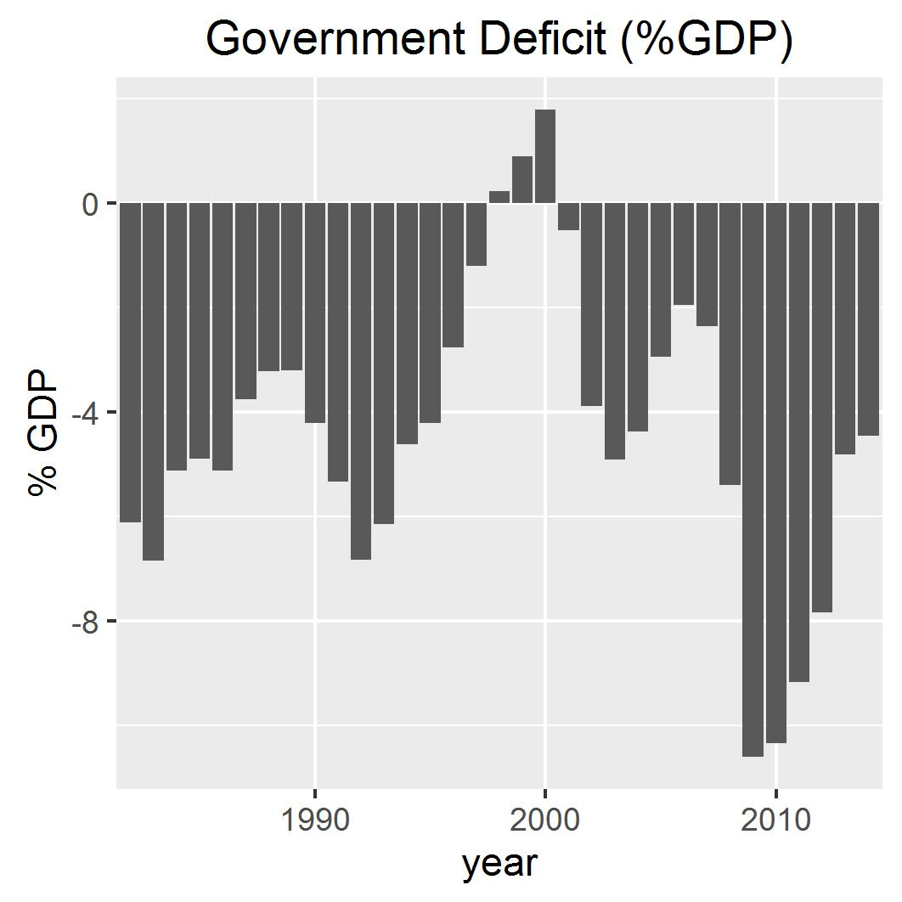

This note sets out to review the analysis in Godley's 1999 paper (@Godley1999b). There were two main aspects to that paper, firstly he analysed the position of the US economy in the light of current and historical data and secondly he used models of the US and the world economies to make a medium-term projection of the future trajectory of the economy under six alternative scenarios for US fiscal and monetary policy.

The insights provided by Godley's analysis at the time were completely contrary to forecasts by the Congressional Budget Office and the Economic Advisors to the President and other conventional wisdom at the time which anticipated continuing steady growth for the US. Godley's paper was so notable at the time that the Levy Institute established a new series of Strategic Reports which are still published to this day. In the period between 1999 at the peak of the dotcom bubble and 2008 in the depths of the global financial crisis, regular reports were published by Godley and other Levy Institute scholars providing a follow-up of the original paper, and charting the trajectory of the US and world economies through the 2000s. A selection is provided in the following list^[available at http://www.levyinstitute.org/publications/?doctype=11], the titles tell a story all on their own.

1. Seven Unsustainable Processes; Godley, January 1999 
2. Notes on the U.S. Trade and Balance of Payments Deficits; Godley, January 2000
3. As the Implosion Begins . . . ? Prospects and Policies for the U.S. Economy: A Strategic View. Godley and Izurieta, July 2001
5. The Developing US Recession and Guidelines for Policy. Godley and Izurieta, October 2001
7. Is Personal Debt Sustainable? Papadimitriou, Shaikh, dos Santos & Zezza, November 2002
8. The US Economy: A Changing Strategic Predicament. Godley, March 2003
9. Deficits, Debts, and Growth: A Reprieve but Not a Pardon. Papadimitriou, Shaikh, dos Santos & Zezza, October 2003
10. Is Deficit-financed Growth Limited? Policies and Prospects in an Election Year. Papadimitriou, Shaikh, dos Santos & Zezza, April 2004
11. Prospects and Policies for the US Economy: Why Net Exports Must Now Be the Motor for U.S. Growth. Godley, Izurieta and Zezza, August 2004
12. How Fragile Is the US Economy? Papadimitriou, Shaikh, dos Santos & Zezza, March 2005
13. The United States and Her Creditors: Can the Symbiosis Last? Godley, Papadimitriou, dos Santos & Zezza, September 2005
14. Are Housing Prices, Household Debt, and Growth Sustainable? Papadimitriou, Chilcote & Zezza, January 2006
15. Can the Growth in the US Current Account Deficit Be Sustained? The Growing Burden of Servicing Foreign-owned U.S. Debt. Papadimitriou, Chilcote & Zezza, May 2006
16. Can Global Imbalances Continue? Papadimitriou, Zezza & Hannsgen, November 2006
17. The US Economy: What's Next? Godley, Papadimitriou, & Zezza, April 2007
18. The US Economy: Is There a Way Out of the Woods? Godley, Papadimitriou & Hannsgen, November 2007
20. Prospects for the United States and the World: A Crisis That Conventional Remedies Cannot Resolve. Godley, Papadimitriou, & Zezza, December 2008

So the task of renewing and updating Godley's analysis has already been carried out by Godley and his colleagues using the same approach and the same models. The value added in this study is ...?

The original analysis identified seven unsustainable processes at work in the economy at the time. These were macroeconomic properties that were out of balance with respect to historical norms.They were:

1. the fall in private saving
2. the rise in the flow of net lending to the private sector
3. the rise in the growth rate of the real money stock
4. the rise in asset prices at a rate that far exceeds the growth rate of profits (or of GDP) 
5. the rise in the budget surplus
6. the rise in the current account deficit
7. the increase in the US net foreign indebtedness relative to GDP

Identification of these imbalances rested upon the existence of *stock-flow norms* which are ratios through time between stock quantities and related flow quantities. The concept was introduced in Godley and Cripps (1983) in which they stated a behavioural axiom that stock variables will not change indefinitely as ratios to related flow variables" (@Godley1983)(p.42). They motivated the idea with several informal analogies: if the flow of a river into a lake increases, the volume of water in the lake will not rise for ever. At some point a new water level will become established where the outflow equals the inflow. In the same way, if the flow of sales by a merchant is constant, his inventory level will not rise or fall indefinitely. If the flow of income is constant, holdings of money will not change indefinitely. This principle is applied to the way that *whole systems* function and it imposes restrictions on the sum of individual actions. An equivalent view of stock-flow norms is to view them as cointegrated time series which can then be analysed using available econometric techniques, and this will be developed in part two of this document.

Part one reproduces the historical analysis with the aim of re-examining those seven unsustainable processes. Part two looks into the stock-flow norms underlying the historical analysis using the econometric methods of cointegrated time series. Part three develops a stock-flow model similar to that in Godley's original paper.    

# Part 1: The Historical Analysis

The plots in the Godley 99 paper are reproduced here. To facilitate comparison with the original paper, the original time span is extended to 2015. Data are taken from the NIPA IMA tables.

```{r echo=FALSE, message=FALSE, warning=FALSE}
library(dplyr)
library(ggplot2)
library(lubridate)
# The gov't net saving values are in Z1 files S.7.a(A) and S.8.a(A), GDP is in S.1.a(A)
    seriesCodes <- data.frame(S.1.a = "a28fd6ff58186c91e3e2987a889a772d",
                              S.3.a = "0a165246a24d5945b5826f137837ad0f",
                              S.4.a = "db842b5f3cf1d6f68ea309acd9f8ce26",
                              S.5.a = "8bae818f5e889fe35e5c76b009a9d5d3",
                              S.6.a = "415394082169fa463349f584889afc8f",
                              S.7.a = "6edca435c2141aa8390b2a6854946677",
                              S.8.a = "6414b0705b484d2403bb0b1ef263072a",
                              S.9.a = "7ae4244e7d17dd16835f53f825485486",
                              f.105 = "848b989b9776e637e52f8b1a3a5b83a6")
    get_file <- function(code){
        url <- paste0("http://www.federalreserve.gov/datadownload/Output.aspx?rel=Z1&series=",
            code,
            "&lastObs=&from=01/01/1960&to=12/31/2015&filetype=csv&label=include&layout=seriesrow")
        newfile <- read.csv (url, header = FALSE,stringsAsFactors = FALSE)
        colnames(newfile) <- newfile[1,]
        newfile <- rename(newfile, itemCode = `Series Name:`)
        newfile <- select(newfile,-(2:5))[2:nrow(newfile),]
        newfile
    }
    TotalEcon <- get_file(seriesCodes$S.1.a)
    HH <- get_file(seriesCodes$S.3.a)
    NFNC <- get_file(seriesCodes$S.4.a)
    NFC <- get_file(seriesCodes$S.5.a)
    FC <- get_file(seriesCodes$S.6.a)
    FedGov <- get_file(seriesCodes$S.7.a)
    StateGov <- get_file(seriesCodes$S.8.a)
    GenGov <- get_file(seriesCodes$f.105)
    ROW <- get_file(seriesCodes$S.9.a)
    Years <- colnames(select(ROW,`1960`:`2014`))
# DEFLATORS
#     manually download the GDP deflators (Table 1.1.9) from NIPA website into file deflators.csv
    deflators <- read.csv("deflators.csv",skip = 4,header = FALSE,stringsAsFactors = FALSE)
    deflators[1,2] <- "Description"
    colnames(deflators) <- deflators[1,]
    deflators <- filter(deflators,Line!="Line")
#    function trim: return string w/o leading or trailing whitespace
    trim <- function (x) gsub("^\\s+|\\s+$", "", x)
    deflators$Description <- trim(deflators$Description)
#     get the deflator for GDP - line 1 of deflators
    def_GDP <- as.numeric(select(deflators[1,],`1960`:`2014`))
#     get the deflator for exports
    def_Exp <- as.numeric(select(filter(deflators,Description=="Exports"),`1960`:`2014`))
#     get the deflator for imports
    def_Imp <- as.numeric(select(filter(deflators,Description=="Imports"),`1960`:`2014`))
#     get the deflator for Federal
    def_Fed <- as.numeric(select(filter(deflators,Description=="Federal"),`1960`:`2014`))
#     get the deflator for State and local
    def_State <- as.numeric(select(filter(deflators,Description=="State and local"),`1960`:`2014`))
#     get the deflator for gov't consumption
    def_GenGov <- as.numeric(select(filter(deflators,
                   Description=="Government consumption expenditures and gross investment"),`1960`:`2014`))
```

1. General Government Structural Balance

This is the gov't surplus/deficit as a percentage of GDP.

```{r echo=FALSE, message=FALSE, warning=FALSE}
#     take the GDP values from TotalEcon itemcode FA896902505
    GDP <- unique(filter(TotalEcon, itemCode == "FA896902505.A"))
#     Deflate GDP to get GDP_def using the GDP deflator def_GDP/100 and divide by 1000 to get billions
    GDP_def <- as.numeric(select(GDP,`1960`:`2014`)) / (10 * def_GDP)
#     The gov't balance is in item code FA366006005.A in table GenGov
    GenGov_balance <- unique(filter(GenGov, itemCode == "FA366006005.A"))
#     Deflate using the general gov consumption and investment deflator
    GenGovBal_def <- as.numeric(select(GenGov_balance,`1960`:`2014`)) / (10 * def_GenGov)
#     Express as % of GDP
    GenGovBal_pc <- 100 * GenGovBal_def / GDP_def
#     Plot % of GDP against years 1982-2014; 1982 is element 23 of the vector
    plotframe <- data.frame(Year=Years[23:55],Percent_of_GDP=GenGovBal_pc[23:55])
    fig1 <- ggplot(plotframe, aes(x=Year,y=Percent_of_GDP)) + 
                geom_bar(stat = "identity") +
                scale_x_discrete(name="year",breaks=seq(from=1960, to=2014, by=10)) +
                labs(x="Year", y="% GDP", title="Government Deficit (%GDP)")
                #theme(legend.position="top",legend.title=element_blank())
#    fig1<- qplot(Year,Percent_of_GDP,stat="identity",position = "dodge",geom="bar")+
#              scale_x_discrete(breaks = seq(from=1982, to=2014, by=10))
    ggsave("fig1.jpg",plot=fig1,width=9, height=9, units="cm")
```

Godley's original plot   | Updated plot
-------------------------|--------------
    | 

Comparing the original and the new plot, the broad shape of the graph is similar in the period 1982-1998 but the numbers are significantly different. The new plot is adjusted for inflation using the GDP deflator provided in the NIPA tables with a base in 2009. Clearly Godley's plot would not have been expressed in 2009 dollars. but it's not stated how the inflation adjustment was made. Godley's plot was also corrected for the business cycle.

Godley commented: "fiscal policy was expansionary until 1992 but has been restrictive since then". In the period following 2001, the budget became expansionary again under the Bush adminstration and its wars, followed by the massive increase in the deficit following the global financial crisis in 2008.

2. Adjusted Fiscal Ratio and GDP

The fiscal ratio is a measure of the government's 'fiscal stance'. It is the ratio of government spending to the average rate of taxation, When the budget is balanced, this ratio will be exactly equal to GDP. It expresses the ratio of the injection from gov't expenditure to the leakage of taxation. It's calculated as follows: $AFR = G / \theta$ where $G$ is gov't expenditure and $\theta$ is the average tax rate.  It is said to be neutral if the deficit is small and does not increase as a share of GDP through time.

```{r echo=FALSE, message=FALSE, warning=FALSE}
#     Total gov't expenditure is FA366900015.A
    GenGov_spend <- unique(filter(GenGov, itemCode == "FA366900015.A"))
#     Deflate by def_GovCons/100 and convert to billions
    GenGovSpend_def <- as.numeric(select(GenGov_spend,`1960`:`2014`))/ (10 * def_GenGov)
#     Taxrate theta is total tax revenue as a % of income (gross or net?)
#     Get total tax revenue from F.105 itemCode FA366010115.A
    GenGov_tax <- unique(filter(GenGov, itemCode == "FA366010115.A"))
    GenGovTax_def <- as.numeric(select(GenGov_tax,`1960`:`2014`)) / (10 * def_GDP)
#     For Income use net national income from table S.1.A itemCode FA896140001
    NNI <- unique(filter(TotalEcon,itemCode =="FA896140001.A"))
    NNI_def <- as.numeric(select(NNI,`1960`:`2014`)) / (10 * def_GDP)
#     Divide GenGov_tax by NNI to get theta
    theta <- GenGovTax_def / NNI_def
#     the fiscal ratio is GenGov_spend / theta
    fiscalRatio <- GenGovSpend_def / theta
#     merge fiscalRatio and GDP into a dataframe for plotting
    plot_frame <- rbind(data.frame(series="fiscal-ratio",year=Years,
                                   Billions_of_2009_dollars=fiscalRatio),
                        data.frame(series="gdp",year=Years,Billions_of_2009_dollars=GDP_def))
    fig2 <- ggplot(plot_frame,aes(x=year,y=Billions_of_2009_dollars)) + 
                geom_line(aes(colour=series, group=series)) +
                scale_x_discrete(breaks = seq(from=1960, to=2014, by=10)) +
                theme(legend.position="top",legend.title=element_blank())
    ggsave("fig2.jpg",plot=fig2,width=9, height=9, units="cm")
```

Godley's original plot   | Updated plot
-------------------------|--------------
    | 

Comparing the plots, again they are similar in shape but not the same. In Godley's paper, the data are corrected for the business cycle and adjusted for inflation by appropriate deflation of both stocks and flows. The data here are adjusted for inflation only, using the GDP deflator from the NIPA accounts with base year 2009. There is no correction for the business cycle.

The fiscal contraction in the period 1992-1998 is visible in both plots. The updated plot appears to show another contraction in the period immediately preceding the crisis^[not sure if this is real or a quirk of the data] followed by the massive expansion afterwards.
 
3. Adjusted Trade Ratio and GDP

The "adjusted trade ratio" (ATR) is constructed according to the same principles as the AFR, that is, it is the ratio of exports and foreign transfers to the average import propensity, with all variables corrected for inflation, relative prices, and the business cycle. It measures the rate at which exports inject demand into the economy compared to the demand leakages of imports. It is calculated as $ATR = X / \mu$ where $X$ is exports of goods and services plus all transfers corrected for price changes and $\mu$ is the average import propensity corrected for the business cycle.

```{r echo=FALSE, message=FALSE, warning=FALSE}
#     Exports and Foreign Transfers:
#      FA266903011 (exports of G&S) + FA266400201 - FA266400101 (net taxes and transfers) in table S.9.a
    tradeData <- unique(filter(ROW, itemCode %in% c("FA266903011.A","FA266400201.A","FA266400101.A")))
    exports <- tradeData[tradeData$itemCode=="FA266903011.A",3:57] +
               tradeData[tradeData$itemCode=="FA266400201.A",3:57] -
               tradeData[tradeData$itemCode=="FA266400101.A",3:57]
#     Deflate by def_Exp/100 and covert to billions
    Exp_def <- as.numeric(exports)/ (10 * def_Exp)
#     For imports use FA266903001 "U.S. imports of goods and services"
    imports <- as.numeric(select(unique(filter(ROW, itemCode == "FA266903001.A")),`1960`:`2014`))
#     Deflate by def_Imp/100 and covert to billions
    Imp_def <- as.numeric(imports)/ (10 * def_Imp)
#     Average Import Propensity is imports / income.
    mu <- Imp_def / NNI_def
#     The trade ratio is exports / mu
    trade_ratio <- Exp_def / mu
#     merge fiscalRatio and GDP into a dataframe for plotting
    plot_frame <- rbind(data.frame(series="trade-ratio",
                                   year=Years,
                                   Billions_of_2009_dollars=trade_ratio),
                        data.frame(series="gdp",
                                   year=Years,
                                   Billions_of_2009_dollars=GDP_def))
    fig4 <- ggplot(plot_frame,aes(x=year,y=Billions_of_2009_dollars)) + 
                geom_line(aes(colour=series, group=series)) +
                scale_x_discrete(breaks = seq(from=1960, to=2014, by=10)) +
                theme(legend.position="top",legend.title=element_blank())
    ggsave("fig4.jpg",plot=fig4,width=9, height=9, units="cm")
```

Godley's original plot   | Updated plot
-------------------------|--------------
    | 

Comparing the plots, the similarity is less than the earlier plots. This may again just be a matter of the adjustments for inflation and the business cycle, but it's likely that there is an issue with the data, to be investigated. As previously, plot 2 is adjusted for inflation using the GDP deflator, but not for the business cycle.

Godley commented "there is no question but that over the "Goldilocks" period as a whole net export demand has made only a weak contribution to the growth of aggregate demand; since the beginning of 1998 its contribution
has been negative, even after allowing for the improvement in the U.S. terms of trade, which, taken by itself, had a beneficial effect on the real national income".

This is shown in plot 2 by the fact that the ATR is wholly below the GDP line and diverging.

(More plots to follow).

# Part 2: The Model
Having analysed the current position, Godley produced a series of projections of the expected trajectory of the US economy under six different scenarios, each reflecting different assumptions about fiscal policy and the current account. This was based on two models, a stock-flow model of the US economy and the CAM model (Cambridge Alphametrics Model) (@Cripps2008) which describes production in and trade between the eleven country blocs which comprise the world economy. The world model was used to derive the level of demand for US exports given the consensus forecast for growth in the rest of the world and the volume of US imports given the level of private disposable income.

The following reproduces (with minor modifications) the stock-flow model used in the original paper:

 Transaction Matrix | Income/Expenditure | Production | Financial Sector | Government | ROW
--------------------|--------------------|------------|------------------|------------|----
Private Expenditure |  -PX               |  PX        |                  |            |    
Gov't Expenditure   |                    |  G         |                  |     -G     |    
Exports             |                    |  X         |                  |            | -X 
Imports             |                    | -M         |                  |            |  M 
--------------------|--------------------|------------|------------------|------------|----
Memo: GDP           |                    | [=GDP]     |                  |            |   
--------------------|--------------------|------------|------------------|------------|----
Net Indirect Taxes  |                    |  -NIT      |                  |      NIT   |    
Total Factor Income |  YF                |  -YF       |                  |            |    
Net Domestic Trfrs  |  DTF               |            |                  |     -DTF   |    
Direct Taxes        |  -DTX              |            |                  |     DTX    |    
Net Interest Inc/Pmt|  INT               |            |                  |            |    
Private Tfers abroad|  -TRF              |            |                  |            | TRF 
--------------------|--------------------|------------|------------------|------------|----
Private Disp Income |  [=YD]             |            |                  |            |   
--------------------|--------------------|------------|------------------|------------|----
Gov't Int Payments  |                    |            |                  |     -INTG  |    
Int. on Loans       |                    |            |      INTL        |            |    
Net Income from ROW |                    |            |                  |            | -YFN
Gov't Tfers abroad  |                    |            |                  |    -TRGF   | TRGF
Net Lend to Pvt Sctr|  $\Delta$ L        |            |    -$\Delta$L    |            |     
--------------------|--------------------|------------|------------------|------------|----
Sectoral Fin Bal    |                    |            |                  |            |   
=$\Delta$Asset/Liab |  $\Delta$ V        |    0       |    $\Delta$ M    | Gov deficit| CAB 
--------------------|--------------------|------------|------------------|------------|----

The corresponding balance sheet capturing the relevant stocks is:

 Balance Sheet  | Income/Expenditure | Production | Financial Sector | Government | Interest Pool | ROW    
----------------|--------------------|------------|------------------|------------|---------------|--------
Pvt sectr loans |  -L                |            |         L        |            |               |          
Pub sectr debt  |                    |            |      $DG_{FS}$   |    -DG     |               |$DG_{FS}$    

This model is quite unusual because of the degree of aggregation of many of the transactions. Godley wrote

"This model has only a limited application because it takes so much as exogenous, for instance, interest rates, exchange rates, asset prices, world commodity prices, the flow of net lending, and the rate of wage inflation. The main objective on the present occasion is to obtain a quantitative sense of the scale and duration of the slowdown that will follow when the lending cycle turns down or if there were a downward adjustment of stock market prices. An equally important objective is to obtain a sense of the interdependence of the whole stock/flow system; it emphasizes, in particular, that the size of the budget surplus cannot be sensibly judged outside the context of what happens to the whole configuration of stocks and flows."

It combines consumption and investment into a composite private expenditure. This is based on the 'New Cambridge' hypothesis that total private expenditure has a systematic and predictable relationship to total private disposable income and the flow of net lending to the private sector. This relationship constitutes a *stock-flow norm* which is defined as a stable ratio over time between a significant stock and an associated flow. In econometric terms, a stock-flow norm is a pair of cointegrated time series. For example, based on time series from the US economy, Zezza shows the relative stability of NAFA as a share of GDP from 1960 to 1996. Stability of this ratio is confirmed by tests for stationarity,which reject the hypothesis of unit roots up to 1996, but fail to do so when the data for the second half of the 90s are included in the sample (@Zezza2003).

Most of Godley's work was based on the assumption of such stable stock-flow norms, which may be considered as the underlying exogenous determinants of the economy's path toward a steady-state. In this case it is the ratio of the desired level of liquid financial assets by the private sector, $V^{*}$, to private disposable income, $YD$, that is the underlying stock-flow norm: $V^{*} = \alpha_{1} YD$ from which can be derived a functional relationship between private expenditure, disposable income, net lending and lagged net worth: $PX = f(YD,\Delta L, V_{-1})$.

## Equations of the Model

1. Private Expenditure: In the original paper, the functional relationship described above for $PX$ is estimated using an autoregressive distributed lag model based on quarterly data from 1968 to the third quarter of 1998.

2. Government Expenditure is exogenous in this model. The six alternative scenarios are defined by taking different assumptions about the US fiscal policy (see later).

2. Exports (X) are determined from the CAM model

2. Imports (M) are determined from the CAM model

3. GDP is determined by the national income identity, $Y = PX + G + (X-M)$

3. Net Indirect Taxes (NIT), are assumed (found?) to be a constant ratio of PX

4. Total Factor income (YF), is determined by the accounting identity, $GDP - NIT = YF$

5. Net Domestic Trfrs (DTF), consists of unemployment benefit and other government benefits, less contributions paid.

6. Direct Taxes (DTX), assuming the average tax rate $\theta$ calculated in part 1 above, the total direct taxes can be computed from total factor income, $DTX = \theta YF$

7. Net Interest Inc/Pmt (INT), the net interest payable/receivable by the private sector is computed as a residual from the adding-up constraint for the 'interest pool' column of the model. $INT = -(INTG -INTL + YFN)$

8. Private Tfers abroad (TRF), assume that this is  provided by the CAM model, but could also be estimated as a function of net income.

9. Private Disposable Income (YD), is the total of the entries in column 1 of the  second section of the model: $YD = YF + DTF - DTX + INT - TRF$

10. Gov't Int Payments (INTG), are computed using an average interest rate on the outstanding gov't debt, $INTG = r DG$.

11. Int. on Loans, are computed using an average interest rate on the outstanding private sector debt, $INTL = r L$.

12. Net Income from ROW 

13. Gov't Tfers abroad

14. Net Lend to Pvt Sctr

15. Sectoral financial balances

## Taking the Model to the Data

```{r echo=FALSE, message=FALSE, warning=FALSE}
####### set up an array for the transaction matrix
    gdp_flow_names <- c("Private Expenditure","Government Expenditure", "Exports",
                        "Imports","Stat Disc","Memo: GDP")
    pdi_flow_names <- c("Net Indirect Taxes","Total Factor Income","Property Income",
                        "Direct Tax","Net Transfers","Memo:Private Disposable Income")
    fof_flow_names <- c("Net Lending/Borrowing","Net Lending to Pvt Sector","Other Change in Fin Assets")
    flow_names <- c(gdp_flow_names, pdi_flow_names,fof_flow_names,"Sectoral Fin Balances")
    sector_names <- c("Inc_Exp", "Prod", "Fin", "Gov", "ROW", "Sum")
    Years <- 1960:2014
    a5 <- array(0,dim=c(length(flow_names),length(sector_names),length(Years)),
                  dimnames = list(flow_names,sector_names,Years))
  ### load the series from the Z1 xml file
    series <- read.csv("Series.csv",check.names = FALSE,stringsAsFactors = FALSE)
    # eliminate index column and convert to $B
    series <- series[2:ncol(series)]
    series[,6:ncol(series)] <- series[,6:ncol(series)] / 1000
####### private expenditure
    # private sector final consumption FA156901001
    pvt_cons <- unique(filter(HH,itemCode==grep("69010",HH$itemCode,value = TRUE)))
    # private sector gross investment  
    #   50509	 Capital formation, net for sectors 15 (HH), 10 (NFNC), 11 (NFC), 79 (FC) (FS code is 50150)
    ncf <- unique(filter(HH,itemCode==grep("50509",HH$itemCode,value = TRUE)))
    ncf <- rbind(ncf,unique(filter(NFNC,itemCode==grep("50509",NFNC$itemCode,value = TRUE))))
    ncf <- rbind(ncf,unique(filter(NFC,itemCode==grep("50509",NFC$itemCode,value = TRUE))))
    ncf <- rbind(ncf,unique(filter(FC,itemCode==grep("50150",FC$itemCode,value = TRUE))))
    #   63000	 Consumption of fixed capital
    cfc <- unique(filter(HH,itemCode==grep("63000",HH$itemCode,value = TRUE)))
    cfc <- rbind(cfc,unique(filter(NFNC,itemCode==unique(grep("63000",NFNC$itemCode,value = TRUE)))))
    cfc <- rbind(cfc,unique(filter(NFC,itemCode==unique(grep("63000",NFC$itemCode,value = TRUE)))))
    cfc <- rbind(cfc,unique(filter(FC,itemCode==unique(grep("63000",FC$itemCode,value = TRUE)))))
    # Total Gross Investment is net capital formation (ncf) + cons of fixed cap (cfc)
    inv <- colSums(select(cfc,`1960`:`2014`)+select(ncf,`1960`:`2014`))
    # PX is pvt_cons + inv
    PX <- (as.numeric(select(pvt_cons,`1960`:`2014`)) + inv) / 1000
    for(y in 1:length(Years)){
        a5["Private Expenditure",c("Inc_Exp","Prod"),y] <- c(-PX[y],PX[y])
    }
####### government expenditure
    # public sector final consumption FA366901005.A
    gov_cons <- unique(filter(GenGov,itemCode==grep("69010",GenGov$itemCode,value = TRUE)))
    # public sector gross investment  
	#   50509	 Capital formation, net for sectors 31 (FedGov), 20 (StateGov)
    gov_ncf <- unique(filter(FedGov,itemCode==grep("50509",FedGov$itemCode,value = TRUE)))
    gov_ncf <- rbind(gov_ncf,unique(filter(StateGov,itemCode==grep("50509",StateGov$itemCode,value = TRUE))))
    #   63000	 Consumption of fixed capital for sectors 36 (GenGov)
    gov_cfc <- unique(filter(GenGov,itemCode==grep("63000",GenGov$itemCode,value = TRUE)))
    gov_inv <- colSums(select(gov_ncf,`1960`:`2014`)) + select(gov_cfc,`1960`:`2014`)
    gov <- (as.numeric(select(gov_cons,`1960`:`2014`)) + as.numeric(gov_inv)) / 1000
    for(y in 1:length(Years)){
        a5["Government Expenditure",c("Prod","Gov"),y] <- c(gov[y],-gov[y])
    }
####### exports
    exp <- unique(filter(ROW,itemCode=="FA266903011.A"))
    exp <- as.numeric(select(exp,`1960`:`2014`)) / (1000)
    for(y in 1:length(Years)){
        a5["Exports",c("Prod","ROW"),y] <- c(exp[y],-exp[y])
    }
####### imports
    imp <- unique(filter(ROW,itemCode=="FA266903001.A"))
    imp <- as.numeric(select(imp,`1960`:`2014`)) / (1000)
    for(y in 1:length(Years)){
        a5["Imports",c("Prod","ROW"),y] <- c(-imp[y],imp[y])
    }
####### GDP
    # take GDP for all sectors 
    gdp <- as.numeric(select(GDP,`1960`:`2014`)) / (1000)
    # GDP figure on income basis, need to apply the statistical discrepancy to convert to expenditure basis
        # The statistical discrepancy is FA087005995 in file TotalEcon
    stat_disc <- unique(filter(TotalEcon,itemCode==grep("70059",TotalEcon$itemCode,value = TRUE)))
    stat_disc <- as.numeric(select(stat_disc,`1960`:`2014`)) / (1000)
    # assign gdp to column "Prod"
    for(y in 1:length(Years)){
        a5["Stat Disc","Prod",y] <- -stat_disc[y]
        a5["Memo: GDP","Prod",y] <- gdp[y]
    }
   
###### Net Indirect Taxes: take data from TotalEcon file and place into Prod column
    #    FA896240001.A Taxes on production and imports, receivable 
    #    FA366402015.A Less Subsidies paid
    nit <- rbind(unique(filter(TotalEcon,itemCode==grep("62400",TotalEcon$itemCode,value = TRUE))),
                 unique(filter(TotalEcon,itemCode==grep("64020",TotalEcon$itemCode,value = TRUE))))
    nit <- as.numeric(colSums(select(nit,`1960`:`2014`)) / (1000))
    for(y in 1:length(Years)){
        a5["Net Indirect Taxes",c("Prod","Gov"),y] <- c(-nit[y],nit[y])
    }
####### Total Factor Income: take data from TotalEcon file and place into Inc/Exp column
    #    ! In the Nat Accs, TFI doesn't include CFC! Add it into tfi to achieve balance
    #    FA896402101.A Net Operating Surplus
    #    FA156025105.A Compensation of Employees received
    #    FA896025001.A Compensation of employees paid
    #    so factor income paid (fip) is NOS + FA896025001, factor income rec'd (fir) is NOS + FA156025105
    #    net factor income to/from ROW is the difference
    nos_cfc <- rbind(unique(filter(TotalEcon,itemCode==grep("64021",TotalEcon$itemCode,value = TRUE))),
                     unique(filter(TotalEcon,itemCode==grep("63000",TotalEcon$itemCode,value = TRUE))))
    fir <- rbind(nos_cfc,                 
                 unique(filter(TotalEcon,itemCode==grep("60251",TotalEcon$itemCode,value = TRUE))))
    fir <- as.numeric(colSums(select(fir,`1960`:`2014`)) / (1000))
    fip <- rbind(nos_cfc,
                 unique(filter(TotalEcon,itemCode==grep("60250",TotalEcon$itemCode,value = TRUE))))
    fip <- as.numeric(colSums(select(fip,`1960`:`2014`)) / (1000))
    fi_row <- fip - fir
    for(y in 1:length(Years)){
        a5["Total Factor Income",c("Inc_Exp","Prod","ROW"),y] <- c(fir[y],-fip[y],fi_row[y])
    }
####### Property Income: take data from TotalEcon file and place into Inc/Exp column
    #    FA896150105    Property income (received)
    #    FA896150005    Property income (paid)
    #    Treat net property income as inc/exp the offset being to/from ROW
    pir <- unique(filter(TotalEcon,itemCode==grep("61501",TotalEcon$itemCode,value = TRUE)))
    pir <- as.numeric(select(pir,`1960`:`2014`)) / 1000
    pip <- unique(filter(TotalEcon,itemCode==grep("61500",TotalEcon$itemCode,value = TRUE)))
    pip <- as.numeric(select(pip,`1960`:`2014`)) / 1000
    net_pi <- pir -pip
    pi_row <- -net_pi
    for(y in 1:length(Years)){
        a5["Property Income",c("Inc_Exp","ROW"),y] <- c(net_pi[y],pi_row[y])
    }
####### Check that Property income abroad + factor income abroad = Net foreign income
    #   FA266904095 Income receipts from the rest of the world
    #   FA266904195 Income payments to the rest of the world
    nfi <- rbind(unique(filter(TotalEcon,itemCode==grep("69040",TotalEcon$itemCode,value = TRUE))),
                 unique(filter(TotalEcon,itemCode==grep("69041",TotalEcon$itemCode,value = TRUE))))
    nfi <- as.numeric(colSums(select(nfi,`1960`:`2014`)) / 1000)
    chk <- (nfi - pi_row - fi_row)
####### Direct Taxes: take data from TotalEcon file and place into Inc/Exp column
    #   FA896220001 Received by Gov'
    #   FA896220005 Paid by domestic sector
    #   difference is net tax paid abroad
    txrc <- unique(filter(TotalEcon,itemCode==grep("6220001",TotalEcon$itemCode,value = TRUE)))
    txrc <- as.numeric(select(txrc,`1960`:`2014`)) / 1000
    txpd <- unique(filter(TotalEcon,itemCode==grep("6220005",TotalEcon$itemCode,value = TRUE)))
    txpd <- as.numeric(select(txpd,`1960`:`2014`)) / 1000
    txrow <- txpd - txrc
    for(y in 1:length(Years)){
        a5["Direct Tax",c("Inc_Exp","Gov","ROW"),y] <- c(-txpd[y],txrc[y],txrow[y])
    }
####### Net Foreign and Domestic Transfers:
    #   Transfers paid by gov't
    #       FA366601005.Q contributions for government social insurance received 1164.1
    #       FA366403105.Q other current transfers received 702.1
    #       FA366404005.Q social contributions paid 2506.6
    #       FA366403005.Q other current transfers paid 547.2
    recpt <- unique(filter(GenGov,itemCode %in% c("FA366601005.A","FA366403105.A")))
    pmt <- unique(filter(GenGov,itemCode %in% c("FA366404005.A","FA366403005.A")))
    gvtfr <- as.numeric(colSums(select(recpt,`1960`:`2014`)) -
                       colSums(select(pmt,`1960`:`2014`))) / (1000)
    #   Foreign Transfers: difference between total tax and transfers abroad and taxes to/from ROW (txrow)
    #       FA266400201 Current taxes and trans. receipts from rest of world
    #       FA266400101 Current taxes and trans. payments to rest of world
    ftfr <- as.numeric(((select(unique(filter(ROW,itemCode=="FA266400101.A")),`1960`:`2014`) -
                     select(unique(filter(ROW,itemCode=="FA266400201.A")),`1960`:`2014`))
                            / 1000)) - txrow
    #   Transfers received by private sector is difference between that paid by gov't and paid to ROW
    pvtfr <- -gvtfr - ftfr
    for(y in 1:length(Years)){
        a5["Net Transfers",c("Inc_Exp","Gov","ROW"),y] <- c(pvtfr[y],gvtfr[y],ftfr[y])
    }
####### Private Disposable Income: 
    #   Total the income entries in the inc/exp column
    for(y in 1:length(Years)){
        a5["Memo:Private Disposable Income","Inc_Exp",y] <-
            sum(a5[pdi_flow_names[which(!grepl("Memo:",pdi_flow_names))],"Inc_Exp",y])
    }

##### NLB on capital account (S - I)
    # HH FA155000905, NFC FA105000905, NFNC FA115000905, FS FA795000995.A, GGov FA365000905.A, ROW FA265000905
    pvt_nlb_codes <- c("FA105000905.A","FA115000905.A","FA155000905.A")
    pvt_nlb <- as.numeric(colSums(select(filter(series,code %in% pvt_nlb_codes),`1960`:`2014`)))
    fs_nlb <- as.numeric(select(filter(series,code == "FA795000995.A"),`1960`:`2014`))
    gov_nlb <- as.numeric(select(filter(series,code == "FA365000905.A"),`1960`:`2014`))
    row_nlb <- as.numeric(select(filter(series,code == "FA265000905.A"),`1960`:`2014`))
    for(y in 1:length(Years)){
        a5["Net Lending/Borrowing",c("Inc_Exp","Fin","Gov","ROW"),y] <-     
            c(pvt_nlb[y],fs_nlb[y],gov_nlb[y],row_nlb[y])
    }
    
####### Net Lending to Private Sector
    # Private Sector: Total Loans as assets  FA**4023005 for sectors 15, 10, 11 
    pvt_loan_asset <- c("FA104035005.A","FA114023005.A","FA154023005.A")          
    # Private Sector: Total Loans as liabilities FA**4123005 for sectors 15, 10, 11 
    pvt_loan_liab <- c("FA104123005.A","FA114123005.A","FA154123005.A")        
    pvt_Loan_assets <- colSums(select(filter(series,code %in% pvt_loan_asset),`1960`:`2014`))
    pvt_Loan_liabs <-  colSums(select(filter(series,code %in% pvt_loan_liab),`1960`:`2014`))
    pvt_netLoans <- as.numeric(pvt_Loan_assets - pvt_Loan_liabs)
    # Financial Sector: loan assets FA794035005; loan liabilities FA794135005
    fs_netLoans <- as.numeric(select(filter(series,code == "FA794035005.A"),`1960`:`2014`) -
                              select(filter(series,code == "FA794135005.A"),`1960`:`2014`))
    # Govt lending (asset) is FA364023005 - FA364123005
    gov_netLoans <- as.numeric(select(filter(series,code == "FA364023005.A"),`1960`:`2014`) -
                            select(filter(series,code == "FA364123005.A"),`1960`:`2014`))
    for(y in 1:length(Years)){
        a5["Net Lending to Pvt Sector",c("Inc_Exp","Fin","Gov"),y] <-     
            c(pvt_netLoans[y],fs_netLoans[y],gov_netLoans[y])
    }

##### Net change in financial assets (excl loans)
    # NAFA      FA154090005.A FA104090005.A FA114090005.A FA794090005.A FA364090005.A FA264090005.A
    # NIL       FA154190005.A FA104190005.A FA114190005.A FA794190005.A FA364190005.A FA264190005.A
    # Statistical Discrepancy FU157005045 FU107005045 FU797005045 FU367005045 FU267005005
    pvt_nafa_codes <- c("FA154090005.A","FA104090005.A","FA114090005.A","FU157005045.A","FU107005045.A","FU117005045.A")
    pvt_nil_codes <- c("FA154190005.A","FA104190005.A","FA114190005.A")
    pvt_nafa <- colSums(select(filter(series,code %in% pvt_nafa_codes),`1960`:`2014`))
    pvt_nil <-  colSums(select(filter(series,code %in% pvt_nil_codes),`1960`:`2014`))
    pvt_net_FA <- as.numeric(pvt_nafa - pvt_nil) - pvt_netLoans
    # fin sector
    fs_net_FA <- as.numeric(colSums(select(filter(series,code %in% c("FA794090005.A","FU797005045.A")),`1960`:`2014`)) -
                            select(filter(series,code == "FA794190005.A"),`1960`:`2014`)) - fs_netLoans
    gov_net_FA <- as.numeric(colSums(select(filter(series,code %in% c("FA364090005.A","FU367005045.A")),`1960`:`2014`)) -
                             select(filter(series,code == "FA364190005.A"),`1960`:`2014`)) - gov_netLoans
    row_net_FA <- as.numeric(colSums(select(filter(series,code %in% c("FA264090005.A","FU267005005.A")),`1960`:`2014`)) -
                              select(filter(series,code == "FA264190005.A"),`1960`:`2014`))
    for(y in 1:length(Years)){
        a5["Other Change in Fin Assets",c("Inc_Exp","Fin","Gov","ROW"),y] <-     
            c(pvt_net_FA[y],fs_net_FA[y],gov_net_FA[y],row_net_FA[y])
    }

#####   re-calculate the sector balances and populate the summation column
    a5["Sectoral Fin Balances",,] <- 0
    a5[,"Sum",] <- 0
    sfb <- colSums(a5[flow_names[which(!grepl("Memo:",flow_names))],,])
    for(y in 1:length(Years)){
        a5["Sectoral Fin Balances",,y] <- sfb[,y]
        a5[,"Sum",y] <- round(rowSums(a5[,,y]),3)
    }
```

Data from the US NIPA and Flow of Funds tables from 1960 to 2014 have been used to calibrate the model.
The following table shows the GDP section of the model for the year 2014 in US$billions.

```{r echo=FALSE, message=FALSE, warning=FALSE}
px14 <- as.integer(a5["Private Expenditure","Inc_Exp","2014"])
g14 <- as.integer(a5["Government Expenditure","Gov","2014"])
x14 <- as.integer(a5["Exports","ROW","2014"])
m14 <- as.integer(a5["Imports","ROW","2014"])
gdp14 <- as.integer(a5["Memo: GDP","Prod","2014"])
sd14 <- as.integer(a5["Stat Disc","Prod","2014"])
```

2014, US billions   | Income/Exp  | Production  | Financial | Government | ROW
--------------------|-------------|-------------|-----------|------------|----
Private Expenditure |`r px14`     |`r -px14`    |           |            |    
Gov't Expenditure   |             |`r -g14`     |           |`r g14`     |    
Exports             |             |`r -x14`     |           |            |`r x14` 
Imports             |             |`r -m14`     |           |            |`r m14`
--------------------|-------------|-------------|-----------|------------|----
Memo: GDP           |             |[`r gdp14`]  |           |            |   
--------------------|-------------|-------------|-----------|------------|----
Statistical         |             |`r sd14`     |           |            |      
Discrepancy         |             |             |           |            |      

The statistical discrepancy arises since the sum of the items in the Production column are derived on an expenditure  basis and the GDP figure is calculated on an income basis.

The second section of the model for disposable income follows:   

```{r echo=FALSE, message=FALSE, warning=FALSE}
nit14 <- as.integer(a5["Net Indirect Taxes","Gov","2014"])
tfi14 <- as.integer(a5["Total Factor Income","Inc_Exp","2014"])
prp14 <- as.integer(a5["Property Income","Inc_Exp","2014"])
tx14 <- as.integer(a5["Direct Tax","Gov","2014"])
tfp14 <- as.integer(a5["Net Transfers","Inc_Exp","2014"])
tfg14 <- as.integer(a5["Net Transfers","Gov","2014"])
tfr14 <- as.integer(a5["Net Transfers","ROW","2014"])
pdi14 <- as.integer(a5["Memo:Private Disposable Income","Inc_Exp","2014"])
```    

2014, US billions   | Income/Exp  | Production  | Financial | Government | ROW
--------------------|-------------|-------------|-----------|------------|----
Net Indirect Taxes  |             |`r -nit14`   |           |`r nit14`   |    
Total Factor Income |`r tfi14`    |`r -tfi14`   |           |            |    
Property Income     |`r prp14`    |             |           |            |`r -prp14`   
Direct Taxes        |`r -tx14`    |             |           |`r tx14`    |    
Net Transfers       |`r tfp14`    |             |           |`r tfg14`   |`r tfr14` 
--------------------|-------------|-------------|-----------|------------|----
Memo: Private       |[`r pdi14`]  |             |           |            |   
Disposable Income   |             |             |           |            |      

The final section of the model is the flow of funds.

```{r echo=FALSE, message=FALSE, warning=FALSE}
nlb14 <- as.integer(a5["Net Indirect Taxes","Gov","2014"])
ln14 <- as.integer(a5["Total Factor Income","Inc_Exp","2014"])
fa14 <- as.integer(a5["Property Income","Inc_Exp","2014"])
```  

2014, US billions   | Income/Exp  | Production  | Financial | Government | ROW
--------------------|-------------|-------------|-----------|------------|----
Net Lend/Borrowing  |             |             |           |            |      
net chng in Loans   |             |             |           |            |      
Other chng Fin Assts|             |             |           |            |      

The column sums of the model give the sectoral financial balances. Grouping the first three columns gives the private sector balance, the Government column gives the public sector balance and the ROW column gives the balance on the current account.

```{r echo=FALSE, message=FALSE, warning=FALSE}
#### plot pvt sector balances as % of GDP (need to convert GDP to billions)
    plot_frame <- rbind(data.frame(series="Pvt Sector Balance",
                             year=Years,
                             amount=
                                 100 * 1000 * (as.numeric(a5["Net Lending/Borrowing","Inc_Exp",]) +
                                               as.numeric(a5["Net Lending/Borrowing","Fin",])) /
                                 as.numeric(select(GDP,`1960`:`2014`))),
                         data.frame(series="Public Sector Balance",
                             year=Years,
                             amount=
                                 100 * 1000 * as.numeric(a5["Net Lending/Borrowing","Gov",]) /
                                 as.numeric(select(GDP,`1960`:`2014`))),
                         data.frame(series="Current Account Balance",
                             year=Years,
                             amount=
                                 -100 * 1000 * as.numeric(a5["Net Lending/Borrowing","ROW",]) /
                                 as.numeric(select(GDP,`1960`:`2014`)))
                        )
     fig5 <- ggplot(plot_frame,aes(x=year,y=amount)) + 
                geom_line(aes(colour=series, group=series)) +
                #scale_x_discrete(name="year",breaks=seq(from=1960, to=2014, by=10)) +
                labs(x="Year", y="% GDP", title="Sectoral Fin Balances (%GDP)") +
                theme(legend.position="top",legend.title=element_blank())
     fig5
```

# Part 3: Stock-Flow Norms
The key stock-flow norm used by Godley is the relationship between total private expenditure, total private disposable income and the flow of net lending to the private sector. This relationship is a version of the 'New Cambridge' equation. In Godley's paper, he uses an autoregressive distributed lag model (ARDL) of the equation for the projections.

Here, the time series for Private Expenditure (PX), Private Disposable Income (PDI) and Private Sector Lending (PSL, shown in red) are plotted together, normalised by GDP. PX and PDI shown at the top, narrow significantly during the 1980s and expenditure exceeds income during two periods in the late 1990s and again immediately prior to the crisis. The movement in these series needs to be related to the movement in lending in the lower part of the plot.

PSL as shown is the change in loan assets less loans liabilites of the private sector. It is normally negative since the private sector usually are borrowers rather than lenders in the loan market. However it is positive for a brief period in 2008-9 as a result of deleveraging following the crisis. As a comparison, two other series are plotted -- other changes in financial assets (i.e. excluding loans) and Net Lending and Borrowing (NLB) which is the total change in financial assets (the sum of the previous two).
```{r echo=FALSE, message=FALSE, warning=FALSE}
#### plot pvt expenditure, disposable income and pvt net lending
    plot_frame <- rbind(data.frame(series="Pvt Sector Lending",
                             year=Years,
                             amount=
                                 100 * 1000 * as.numeric(a5["Net Lending to Pvt Sector","Inc_Exp",]) /
                                 as.numeric(select(GDP,`1960`:`2014`))),
                        data.frame(series="Private Expenditure",
                             year=Years,
                             amount=
                                 -100 * 1000 * as.numeric(a5["Private Expenditure","Inc_Exp",]) / 
                                 as.numeric(select(GDP,`1960`:`2014`))),
                        data.frame(series="Private Disposable Income",
                             year=Years,
                             amount=
                                 100 * 1000 * as.numeric(a5["Memo:Private Disposable Income","Inc_Exp",]) / 
                                 as.numeric(select(GDP,`1960`:`2014`))
                             ),
                        data.frame(series="Other Changes in Household Assets",
                             year=Years,
                             amount=
                                 100 * 1000 * as.numeric(a5["Other Change in Fin Assets","Inc_Exp",]) / 
                                 as.numeric(select(GDP,`1960`:`2014`))
                             ),
                        data.frame(series="Net Lending/Borrowing",
                             year=Years,
                             amount=
                                 100 * 1000 * as.numeric(a5["Net Lending/Borrowing","Inc_Exp",]) / 
                                 as.numeric(select(GDP,`1960`:`2014`))
                             )                        
                        )
    fig6 <- ggplot(plot_frame,aes(x=year,y=amount)) + 
                geom_line(aes(colour=series, group=series)) +
                #scale_x_discrete(name="year",breaks=seq(from=1960, to=2014, by=10)) +
                labs(x="Year", y="% GDP", title="Net Lending to Private Sector (%GDP)") +
                theme(legend.position="right",legend.title=element_blank())
    fig6
```
The three time series were then tested in Eviews and shown to be non-stationary. Next, a Johansen cointegration test showed the series PX, PDI and PSL to be cointegrated.

.

Attempting to reproduce the Godley's ARDL equation, is still work in progress. He used quarterly time series adjusted for inflation and the business cycle, whereas these data are annual.

The next step is to explore the existence of other stock-flow norms underlying the seven unsustainable processes:

1. the fall in private saving
2. the rise in the flow of net lending to the private sector
3. the rise in the growth rate of the real money stock
4. the rise in asset prices at a rate that far exceeds the growth rate of profits (or of GDP) 
5. the rise in the budget surplus
6. the rise in the current account deficit
7. the increase in the US net foreign indebtedness relative to GDP

Some of these may better correspond to flow-flow norms, e.g. in (1) private saving is a flow and could be expected to have a stable relationship to disposable income. Many of the others should have stable relationships to GDP (flow) or net worth (stock).

```{r echo=FALSE, message=FALSE, warning=FALSE}
    # with help from http://www.econ.uiuc.edu/~econ508/R/e-ta8_R.html
    #require(stats)
# declare PX, PDI and NL as time series
    Pex <- ts(PX)
    PDI <- ts(a5["Memo:Private Disposable Income","Inc_Exp",])
    NL <- ts(a5["Net Lending to Pvt Sector","Inc_Exp",])
# unit root: Augmented Dickey Fuller Test
  # use the function adf
  # #  "adf" <- function(x,k = 0, int = TRUE, trend = FALSE){
  #   # NB:  returns conventional lm summary so p-values for adf test are wrong!
  #   require(dynlm)
  #   dx <- diff(x)
  #   formula <- paste("dx ~ L(x)")
  #   if(k > 0)
  #       formula <- paste(formula," + L(dx,1:k)")
  #   if(trend){
  #       s <- time(x)
  #       t <- ts(s - s[1],start = s[1],freq = frequency(x))
  #       formula <- paste(formula," + t")
  #       }
  #   if(!int) formula <- paste(formula," - 1")
  #   summary(dynlm(as.formula(formula)))
  #   }
  # sketch the ADF test, explaining the NULL and the ALTERNATIVE hypotheses. "adf" runs the unit root test for each case.
  # use the ADF test for each individual series, controlling for the number of lags, and the inclusion of constants and trends.
  #  adf(Pex, k=1, int=T, trend=F) 
   df <- data.frame(Pex=Pex,PDI=PDI,NL=-NL)
   write.csv(df,"df.csv")
```

# References

