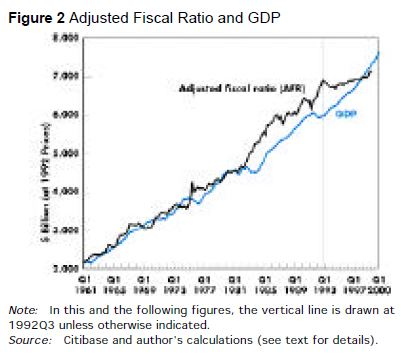
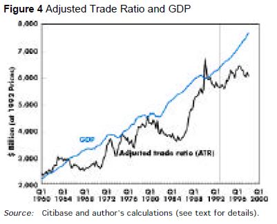

This note sets out to review the economic projections in Godley's 1999 paper (@Godley1999b) with the benefit of hindsight to compare them to the trajectory actually taken by the US economy. In that paper, Godley analysed the US fiscal position, its current account position and the position of the private sector in terms of expenditure, saving and borrowing, to assess the sustainability of the economic policy being advocated at the time by the US administration in the light of the recomendations of the Congressional Budget Office and the Economic Advisors to the President.  

It will attempt to reproduce the analysis he performed in   

Part 1 reproduces many of the significant data plots 

is to reconstruct the model in Godley99 and to populate it with recent data to compare the actual trajectory of the US economy with the projections made in Godley's paper in 1999. But also to recalculate the stock flow norms that he used:

# Part 1: Comparison of Time Series

The plots in the Godley 99 paper are reproduced here. To facilitate comparison with the original paper, the original time span is extended to 2015. Data are taken from the NIPA IMA tables.

```{r echo=FALSE, message=FALSE, warning=FALSE}
library(dplyr)
library(ggplot2)
# The gov't net saving values are in Z1 files S.7.a(A) and S.8.a(A), GDP is in S.1.a(A)
    seriesCodes <- data.frame(S.1.a = "a28fd6ff58186c91e3e2987a889a772d",
                              S.3.a = "0a165246a24d5945b5826f137837ad0f",
                              S.4.a = "db842b5f3cf1d6f68ea309acd9f8ce26",
                              S.5.a = "8bae818f5e889fe35e5c76b009a9d5d3",
                              S.6.a = "415394082169fa463349f584889afc8f",
                              S.7.a = "6edca435c2141aa8390b2a6854946677",
                              S.8.a = "6414b0705b484d2403bb0b1ef263072a",
                              S.9.a = "7ae4244e7d17dd16835f53f825485486",
                              f.105 = "848b989b9776e637e52f8b1a3a5b83a6")
    get_file <- function(code){
        url <- paste0("http://www.federalreserve.gov/datadownload/Output.aspx?rel=Z1&series=",
            code,
            "&lastObs=&from=01/01/1960&to=12/31/2015&filetype=csv&label=include&layout=seriesrow")
        newfile <- read.csv (url, header = FALSE,stringsAsFactors = FALSE)
        colnames(newfile) <- newfile[1,]
        newfile <- rename(newfile, itemCode = `Series Name:`)
        newfile <- select(newfile,-(2:5))[2:nrow(newfile),]
        newfile
    }
    TotalEcon <- get_file(seriesCodes$S.1.a)
    HH <- get_file(seriesCodes$S.3.a)
    NFNC <- get_file(seriesCodes$S.4.a)
    NFC <- get_file(seriesCodes$S.5.a)
    FC <- get_file(seriesCodes$S.6.a)
    FedGov <- get_file(seriesCodes$S.7.a)
    StateGov <- get_file(seriesCodes$S.8.a)
    GenGov <- get_file(seriesCodes$f.105)
    ROW <- get_file(seriesCodes$S.9.a)
    Years <- colnames(select(ROW,`1960`:`2014`))
# DEFLATORS
#     manually download the GDP deflators (Table 1.1.9) from NIPA website into file deflators.csv
    deflators <- read.csv("deflators.csv",skip = 4,header = FALSE,stringsAsFactors = FALSE)
    deflators[1,2] <- "Description"
    colnames(deflators) <- deflators[1,]
    deflators <- filter(deflators,Line!="Line")
#    function trim: return string w/o leading or trailing whitespace
    trim <- function (x) gsub("^\\s+|\\s+$", "", x)
    deflators$Description <- trim(deflators$Description)
#     get the deflator for GDP - line 1 of deflators
    def_GDP <- as.numeric(select(deflators[1,],`1960`:`2014`))
#     get the deflator for exports
    def_Exp <- as.numeric(select(filter(deflators,Description=="Exports"),`1960`:`2014`))
#     get the deflator for imports
    def_Imp <- as.numeric(select(filter(deflators,Description=="Imports"),`1960`:`2014`))
#     get the deflator for Federal
    def_Fed <- as.numeric(select(filter(deflators,Description=="Federal"),`1960`:`2014`))
#     get the deflator for State and local
    def_State <- as.numeric(select(filter(deflators,Description=="State and local"),`1960`:`2014`))
#     get the deflator for gov't consumption
    def_GenGov <- as.numeric(select(filter(deflators,
                   Description=="Government consumption expenditures and gross investment"),`1960`:`2014`))
```

1. General Government Structural Balance

This is the gov't surplus/deficit as a percentage of GDP.

```{r echo=FALSE, message=FALSE, warning=FALSE}
#     take the GDP values from TotalEcon itemcode FA896902505 
    GDP <- unique(filter(TotalEcon, itemCode == "FA896902505.A"))
#     Deflate GDP to get GDP_def using the GDP deflator def_GDP/100 and divide by 1000 to get billions
    GDP_def <- as.numeric(select(GDP,`1960`:`2014`)) / (10 * def_GDP)
#     The gov't balance is in item code FA366006005.A in table GenGov
    GenGov_balance <- unique(filter(GenGov, itemCode == "FA366006005.A"))
#     Deflate using the general gov consumption and investment deflator
    GenGovBal_def <- as.numeric(select(GenGov_balance,`1960`:`2014`)) / (10 * def_GenGov)
#     Express as % of GDP
    GenGovBal_pc <- 100 * GenGovBal_def / GDP_def
#     Plot % of GDP against years 1982-2014; 1982 is element 23 of the vector
    Year <- Years[23:55]
    Percent_of_GDP<-GenGovBal_pc[23:55]
    fig1<- qplot(Year,Percent_of_GDP,stat="identity",position = "dodge",geom="bar")+
              scale_x_discrete(breaks = seq(from=1982, to=2014, by=10))
    ggsave("fig1.jpg",plot=fig1,width=9, height=9, units="cm")
```

Plot 1                   | Plot 2
-------------------------|--------------
    | 

Comparing the original with plot 2, the broad shape of the graph is similar in the period 1982-1998 but the numbers are significantly different. Plot 2 is adjusted for inflation using the GDP deflator provided in the NIPA tables with a base in 2009. Godley's adjusted figures presumably corrected also for the business cycle.

Godley commented: "fiscal policy was expansionary until 1992 but has been restrictive since then". In the period following 2001, the budget became expansionary again under the Bush adminstration and its wars, followed by the massive increase in the deficit following the global financial crisis in 2008.

2. Adjusted Fiscal Ratio and GDP

The fiscal ratio is a measure of the government's 'fiscal stance'. It is the ratio of government spending to the average rate of taxation, When the budget is balanced, this ratio will be exactly equal to GDP. It expresses the ratio of the injection from gov't expenditure to the leakage of taxation. It's calculated as follows: $AFR = G / \theta$ where $G$ is gov't expenditure and $\theta$ is the average tax rate.  It is said to be neutral if the deficit is small and does not increase as a share of GDP through time.

```{r echo=FALSE, message=FALSE, warning=FALSE}
#     Total gov't expenditure is FA366900015.A
    GenGov_spend <- unique(filter(GenGov, itemCode == "FA366900015.A"))
#     Deflate by def_GovCons/100 and convert to billions
    GenGovSpend_def <- as.numeric(select(GenGov_spend,`1960`:`2014`))/ (10 * def_GenGov)
#     Taxrate theta is total tax revenue as a % of income (gross or net?)
#     Get total tax revenue from F.105 itemCode FA366010115.A
    GenGov_tax <- unique(filter(GenGov, itemCode == "FA366010115.A"))
    GenGovTax_def <- as.numeric(select(GenGov_tax,`1960`:`2014`)) / (10 * def_GDP)
#     For Income use net national income from table S.1.A itemCode FA896140001
    NNI <- unique(filter(TotalEcon,itemCode =="FA896140001.A"))
    NNI_def <- as.numeric(select(NNI,`1960`:`2014`)) / (10 * def_GDP)
#     Divide GenGov_tax by NNI to get theta
    theta <- GenGovTax_def / NNI_def
#     the fiscal ratio is GenGov_spend / theta
    fiscalRatio <- GenGovSpend_def / theta
#     merge fiscalRatio and GDP into a dataframe for plotting
    plot_frame <- rbind(data.frame(series="fiscal-ratio",year=Years,
                                   Billions_of_2009_dollars=fiscalRatio),
                        data.frame(series="gdp",year=Years,Billions_of_2009_dollars=GDP_def))
    fig2 <- ggplot(plot_frame,aes(x=year,y=Billions_of_2009_dollars)) + 
                geom_line(aes(colour=series, group=series)) +
                scale_x_discrete(breaks = seq(from=1960, to=2014, by=10)) +
                theme(legend.position="top",legend.title=element_blank())
    ggsave("fig2.jpg",plot=fig2,width=9, height=9, units="cm")
```

Plot 1                   | Plot 2
-------------------------|--------------
    | 

Comparing the plots, again they are similar in shape but not the same. In Godley's paper, the data are corrected for the business cycle and adjusted for inflation by appropriate deflation of both stocks and flows. The data here are adjusted for inflation only, using the GDP deflator from the NIPA accounts with base year 2009. There is no correction for the business cycle.

The fiscal contraction in the period 1992-1998 is visible in both plots. Plot 2 appears to show another contraction in the period immediately preceding the crisis^[not sure if this is real or a quirk of the data] followed by the massive expansion afterwards.
 
3. Adjusted Trade Ratio and GDP

The "adjusted trade ratio" (ATR) is constructed according to the same principles as the AFR, that is, it is the ratio of exports and foreign transfers to the average import propensity, with all variables corrected for inflation, relative prices, and the business cycle. It measures the rate at which exports inject demand into the economy compared to the demand leakages of imports. It is calculated as $ATR = X / \mu$ where $X$ is exports of goods and services plus all transfers corrected for price changes and $\mu$ is the average import propensity corrected for the business cycle.

```{r echo=FALSE, message=FALSE, warning=FALSE}
#     Exports and Foreign Transfers:
#      FA266903011 (exports of G&S) + FA266400201 - FA266400101 (net taxes and transfers) in table S.9.a
    tradeData <- unique(filter(ROW, itemCode %in% c("FA266903011.A","FA266400201.A","FA266400101.A")))
    exports <- tradeData[tradeData$itemCode=="FA266903011.A",3:57] +
               tradeData[tradeData$itemCode=="FA266400201.A",3:57] -
               tradeData[tradeData$itemCode=="FA266400101.A",3:57]
#     Deflate by def_Exp/100 and covert to billions
    Exp_def <- as.numeric(exports)/ (10 * def_Exp)
#     For imports use FA266903001 "U.S. imports of goods and services"
    imports <- as.numeric(select(unique(filter(ROW, itemCode == "FA266903001.A")),`1960`:`2014`))
#     Deflate by def_Imp/100 and covert to billions
    Imp_def <- as.numeric(imports)/ (10 * def_Imp)
#     Average Import Propensity is imports / income.
    mu <- Imp_def / NNI_def
#     The trade ratio is exports / mu
    trade_ratio <- Exp_def / mu
#     merge fiscalRatio and GDP into a dataframe for plotting
    plot_frame <- rbind(data.frame(series="trade-ratio",
                                   year=Years,
                                   Billions_of_2009_dollars=trade_ratio),
                        data.frame(series="gdp",
                                   year=Years,
                                   Billions_of_2009_dollars=GDP_def))
    fig4 <- ggplot(plot_frame,aes(x=year,y=Billions_of_2009_dollars)) + 
                geom_line(aes(colour=series, group=series)) +
                scale_x_discrete(breaks = seq(from=1960, to=2014, by=10)) +
                theme(legend.position="top",legend.title=element_blank())
    ggsave("fig4.jpg",plot=fig4,width=9, height=9, units="cm")
```

Plot 1                   | Plot 2
-------------------------|--------------
    | 

Comparing the plots, the similarity is less than the earlier plots. This may again just be a matter of the adjustments for inflation and the business cycle, but it's likely that there is an issue with the data, to be investigated. As previously, plot 2 is adjusted for inflation using the GDP deflator, but not for the business cycle.

Godley commented "there is no question but that over the "Goldilocks" period as a whole net export demand has made only a weak contribution to the growth of aggregate demand; since the beginning of 1998 its contribution
has been negative, even after allowing for the improvement in the U.S. terms of trade, which, taken by itself, had a beneficial effect on the real national income".

This is shown in plot 2 by the fact that the ATR is wholly below the GDP line and diverging.

(More plots to follow).

# Part 2: The Model
Having analysed the current position, Godley produced a series of projections of the expected trajectory of the US economy under six different scenarios, each reflecting different assumptions about fiscal policy and the current account. This was based on two models, a stock-flow model of the US economy and the CAM model (Cambridge Alphametrics Model) (@Cripps2008) which describes production in and trade between the eleven country blocs which comprise the world economy. The world model was used to derive the level of demand for US exports given the consensus forecast for growth in the rest of the world and the volume of US imports given the level of private disposable income.

The following reproduces (with minor modifications) the stock-flow model used in the original paper:

 Transaction Matrix | Income/Expenditure | Production | Financial Sector | Government | Interest Pool | ROW
--------------------|--------------------|------------|------------------|------------|---------------|----
Private Expenditure |  -PX               |  PX        |                  |            |               |    
Gov't Expenditure   |                    |  G         |                  |     -G     |               |    
Exports             |                    |  X         |                  |            |               | -X 
Imports             |                    | -M         |                  |            |               |  M 
--------------------|--------------------|------------|------------------|------------|---------------|----
Memo: GDP           |                    | [=GDP]     |                  |            |               |   
--------------------|--------------------|------------|------------------|------------|---------------|----
Net Indirect Taxes  |                    |  -NIT      |                  |      NIT   |               |    
Total Factor Income |  YF                |  -YF       |                  |            |               |    
Net Domestic Trfrs  |  DTF               |            |                  |     -DTF   |               |    
Direct Taxes        |  -DTX              |            |                  |     DTX    |               |    
Net Interest Inc/Pmt|  INT               |            |                  |            |    -INT       |    
Private Tfers abroad|  -TRF              |            |                  |            |               | TRF 
--------------------|--------------------|------------|------------------|------------|---------------|----
Private Disp Income |  [=YD]             |            |                  |            |               |   
--------------------|--------------------|------------|------------------|------------|---------------|----
Gov't Int Payments  |                    |            |                  |     -INTG  |     INTG      |    
Int. on Loans       |                    |            |      INTL        |            |    -INTL      |    
Net Income from ROW |                    |            |                  |            |     YFN       |-YFN
Gov't Tfers abroad  |                    |            |                  |    -TRGF   |               |TRGF
Net Lend to Pvt Sctr|  $\Delta$ L        |            |    -$\Delta$L    |            |               |    
--------------------|--------------------|------------|------------------|------------|---------------|----
Sectoral Fin Bal    |                    |            |                  |            |               |   
=$\Delta$Asset/Liab |  $\Delta$ V        |    0       |    $\Delta$ M    | Gov deficit|      0        | CAB 
--------------------|--------------------|------------|------------------|------------|---------------|----

The corresponding balance sheet capturing the relevant stocks is:

 Balance Sheet  | Income/Expenditure | Production | Financial Sector | Government | Interest Pool | ROW    
----------------|--------------------|------------|------------------|------------|---------------|--------
Pvt sectr loans |  -L                |            |         L        |            |               |          
Pub sectr debt  |                    |            |      $DG_{FS}$   |    -DG     |               |$DG_{FS}$    

This model is quite unusual because of the degree of aggregation of many of the transactions. Godley wrote

*"This model has only a limited application because it takes so much as exogenous, for instance, interest rates, exchange rates, asset prices, world commodity prices, the flow of net lending, and the rate of wage inflation. The main objective on the present occasion is to obtain a quantitative sense of the scale and duration of the slowdown that will follow when the lending cycle turns down or if there were a downward adjustment of stock market prices. An equally important objective is to obtain a sense of the interdependence of the whole stock/flow system; it emphasizes, in particular, that the size of the budget surplus cannot be sensibly judged outside the context of what happens to the whole configuration of stocks and flows."*

It combines consumption and investment into a composite private expenditure. This is based on the 'New Cambridge' hypothesis that total private expenditure has a systematic and predictable relationship to total private disposable income and the flow of net lending to the private sector. This relationship constitutes a *stock-flow norm* which is defined as a stable ratio over time between a significant stock and an associated flow. In econometric terms, a stock-flow norm is a pair of cointegrated time series. For example, based on time series from the US economy, Zezza shows the relative stability of NAFA as a share of GDP from 1960 to 1996. Stability of this ratio is confirmed by tests for stationarity,which reject the hypothesis of unit roots up to 1996, but fail to do so when the data for the second half of the 90s are included in the sample (@Zezza2003).

Most of Godley's work was based on the assumption of such stable stock-flow norms, which may be considered as the underlying exogenous determinants of the economy's path toward a steady-state. In this case it is the ratio of the desired level of liquid financial assets by the private sector, $V^{*}$, to private disposable income, $YD$, that is the underlying stock-flow norm: $V^{*} = \alpha_{1} YD$ from which can be derived a functional relationship between private expenditure, disposable income, net lending and lagged net worth: $PX = f(YD,\Delta L, V_{-1})$.

## Equations of the Model

1. Private Expenditure: In the original paper, the functional relationship described above for $PX$ is estimated using an autoregressive distributed lag model based on quarterly data from 1968 to the third quarter of 1998.

2. Government Expenditure is exogenous in this model. The six alternative scenarios are defined by taking different assumptions about the US fiscal policy (see later).

2. Exports (X) are determined from the CAM model

2. Imports (M) are determined from the CAM model

3. GDP is determined by the national income identity, $Y = PX + G + (X-M)$

3. Net Indirect Taxes (NIT), are assumed (found?) to be a constant ratio of PX

4. Total Factor income (YF), is determined by the accounting identity, $GDP - NIT = YF$

5. Net Domestic Trfrs (DTF), consists of unemployment benefit and other government benefits, less contributions paid.

6. Direct Taxes (DTX), assuming the average tax rate $\theta$ calculated in part 1 above, the total direct taxes can be computed from total factor income, $DTX = \theta YF$

7. Net Interest Inc/Pmt (INT), the net interest payable/receivable by the private sector is computed as a residual from the adding-up constraint for the 'interest pool' column of the model. $INT = -(INTG -INTL + YFN)$

8. Private Tfers abroad (TRF), assume that this is  provided by the CAM model, but could also be estimated as a function of net income.

9. Private Disposable Income (YD), is the total of the entries in column 1 of the  second section of the model: $YD = YF + DTF - DTX + INT - TRF$

10. Gov't Int Payments (INTG), are computed using an average interest rate on the outstanding gov't debt, $INTG = r DG$.

11. Int. on Loans, are computed using an average interest rate on the outstanding private sector debt, $INTL = r L$.

12. Net Income from ROW 

13. Gov't Tfers abroad

14. Net Lend to Pvt Sctr

15. Sectoral financial balances

## Model Calibration

Data from the US NIPA and Flow of Funds tables from 1960 to 2014 has been used to calibrate the model. The following table shows the GDP section of the model for the year 2014 in US$billions. The statistical discrepancy arises when comparing the total GDP figure which is derived in the tables using the income basis with GDP calculated on an expenditure basis.

```{r echo=FALSE, message=FALSE, warning=FALSE}
    flow_names <- c("Private Expenditure","Government Expenditure", "Exports", "Imports","Stat Disc", "Memo: GDP")
    sector_names <- c("Inc_Exp", "Prod", "Fin", "Gov", "Int", "ROW")
    Years <- 1960:2014
    a5 <- array(0,dim=c(length(flow_names),length(sector_names),length(Years)),
                  dimnames = list(flow_names,sector_names,Years))
####### private expenditure
    # private sector final consumption FA156901001
    pvt_cons <- unique(filter(HH,itemCode==grep("69010",HH$itemCode,value = TRUE)))
    # private sector gross investment  
    #   50509	 Capital formation, net for sectors 15 (HH), 10 (NFNC), 11 (NFC), 79 (FC) (FS code is 50150)
    ncf <- unique(filter(HH,itemCode==grep("50509",HH$itemCode,value = TRUE)))
    ncf <- rbind(ncf,unique(filter(NFNC,itemCode==grep("50509",NFNC$itemCode,value = TRUE))))
    ncf <- rbind(ncf,unique(filter(NFC,itemCode==grep("50509",NFC$itemCode,value = TRUE))))
    ncf <- rbind(ncf,unique(filter(FC,itemCode==grep("50150",FC$itemCode,value = TRUE))))
    #   63000	 Consumption of fixed capital
    cfc <- unique(filter(HH,itemCode==grep("63000",HH$itemCode,value = TRUE)))
    cfc <- rbind(cfc,unique(filter(NFNC,itemCode==grep("63000",NFNC$itemCode,value = TRUE))))
    cfc <- rbind(cfc,unique(filter(NFC,itemCode==grep("63000",NFC$itemCode,value = TRUE))))
    cfc <- rbind(cfc,unique(filter(FC,itemCode==grep("63000",FC$itemCode,value = TRUE))))
    # Total Gross Investment is net capital formation (ncf) + cons of fixed cap (cfc)
    inv <- colSums(select(cfc,`1960`:`2014`)+select(ncf,`1960`:`2014`))
    # PX is pvt_cons + inv
    PX <- (as.numeric(select(pvt_cons,`1960`:`2014`)) + inv) / 1000
    for(y in 1:length(Years)){
        a5["Private Expenditure",c("Inc_Exp","Prod"),y] <- c(-PX[y],PX[y])
    }
####### government expenditure
    # public sector final consumption FA366901005.A
    gov_cons <- unique(filter(GenGov,itemCode==grep("69010",GenGov$itemCode,value = TRUE)))
    # public sector gross investment  
	#   50509	 Capital formation, net for sectors 31 (FedGov), 20 (StateGov)
    gov_ncf <- unique(filter(FedGov,itemCode==grep("50509",FedGov$itemCode,value = TRUE)))
    gov_ncf <- rbind(gov_ncf,unique(filter(StateGov,itemCode==grep("50509",StateGov$itemCode,value = TRUE))))
    #   63000	 Consumption of fixed capital for sectors 36 (GenGov)
    gov_cfc <- unique(filter(GenGov,itemCode==grep("63000",GenGov$itemCode,value = TRUE)))
    gov_inv <- colSums(select(gov_ncf,`1960`:`2014`)) + select(gov_cfc,`1960`:`2014`)
    gov <- (as.numeric(select(gov_cons,`1960`:`2014`)) + as.numeric(gov_inv)) / 1000
    for(y in 1:length(Years)){
        a5["Government Expenditure",c("Prod","Gov"),y] <- c(gov[y],-gov[y])
    }
####### exports
    exp <- unique(filter(ROW,itemCode=="FA266903011.A"))
    exp <- as.numeric(select(exp,`1960`:`2014`)) / (1000)
    for(y in 1:length(Years)){
        a5["Exports",c("Prod","ROW"),y] <- c(exp[y],-exp[y])
    }
####### imports
    imp <- unique(filter(ROW,itemCode=="FA266903001.A"))
    imp <- as.numeric(select(imp,`1960`:`2014`)) / (1000)
    for(y in 1:length(Years)){
        a5["Imports",c("Prod","ROW"),y] <- c(-imp[y],imp[y])
    }
####### GDP
    # take GDP for all sectors 
    gdp <- as.numeric(select(GDP,`1960`:`2014`)) / (1000)
    # GDP figure on income basis, need to apply the statistical discrepancy to convert to expenditure basis
        # The statistical discrepancy is FA087005995 in file TotalEcon
    stat_disc <- unique(filter(TotalEcon,itemCode==grep("70059",TotalEcon$itemCode,value = TRUE)))
    stat_disc <- as.numeric(select(stat_disc,`1960`:`2014`)) / (1000)
    # assign gdp to column "Prod"
    for(y in 1:length(Years)){
        a5["Stat Disc","Prod",y] <- -stat_disc[y]
        a5["Memo: GDP","Prod",y] <- gdp[y]
    }
a5[,,"2014"]
```


# References

