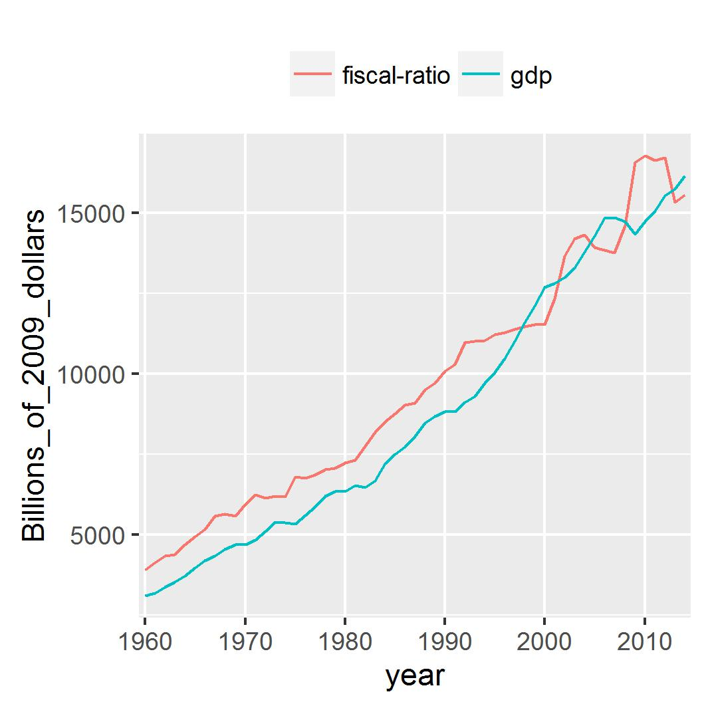

The plots in the Godley 99 paper are reproduced here. To facilitate comparison with the original paper, the same time span is used, but extended to 2015. Data are taken from the NIPA IMA tables.

```{r echo=FALSE, message=FALSE, warning=FALSE}
library(dplyr)
library(ggplot2)
# The gov't net saving values are in Z1 files S.7.a(A) and S.8.a(A), GDP is in S.1.a(A)
    seriesCodes <- data.frame(S.1.a = "a28fd6ff58186c91e3e2987a889a772d",
                              S.7.a = "6edca435c2141aa8390b2a6854946677",
                              S.8.a = "6414b0705b484d2403bb0b1ef263072a",
                              S.9.a = "7ae4244e7d17dd16835f53f825485486",
                              f.105 = "848b989b9776e637e52f8b1a3a5b83a6")
    get_file <- function(code){
        url <- paste0("http://www.federalreserve.gov/datadownload/Output.aspx?rel=Z1&series=",
            code,
            "&lastObs=&from=01/01/1960&to=12/31/2015&filetype=csv&label=include&layout=seriesrow")
        newfile <- read.csv (url, header = FALSE,stringsAsFactors = FALSE)
        colnames(newfile) <- newfile[1,]
        newfile <- rename(newfile, itemCode = `Series Name:`)
        newfile <- select(newfile,-(2:5))[2:nrow(newfile),]
        newfile
    }
    TotalEcon <- get_file(seriesCodes$S.1.a)
    FedGov <- get_file(seriesCodes$S.7.a)
    StateGov <- get_file(seriesCodes$S.8.a)
    GenGov <- get_file(seriesCodes$f.105)
    ROW <- get_file(seriesCodes$S.9.a)
    Years <- colnames(select(ROW,`1960`:`2014`))
# DEFLATORS
#     manually download the GDP deflators (Table 1.1.9) from NIPA website into file deflators.csv
    deflators <- read.csv("deflators.csv",skip = 4,header = FALSE,stringsAsFactors = FALSE)
    deflators[1,2] <- "Description"
    colnames(deflators) <- deflators[1,]
    deflators <- filter(deflators,Line!="Line")
#    function trim: return string w/o leading or trailing whitespace
    trim <- function (x) gsub("^\\s+|\\s+$", "", x)
    deflators$Description <- trim(deflators$Description)
#     get the deflator for GDP - line 1 of deflators
    def_GDP <- as.numeric(select(deflators[1,],`1960`:`2014`))
#     get the deflator for exports
    def_Exp <- as.numeric(select(filter(deflators,Description=="Exports"),`1960`:`2014`))
#     get the deflator for imports
    def_Imp <- as.numeric(select(filter(deflators,Description=="Imports"),`1960`:`2014`))
#     get the deflator for Federal
    def_Fed <- as.numeric(select(filter(deflators,Description=="Federal"),`1960`:`2014`))
#     get the deflator for State and local
    def_State <- as.numeric(select(filter(deflators,Description=="State and local"),`1960`:`2014`))
#     get the deflator for gov't consumption
    def_GenGov <- as.numeric(select(filter(deflators,
                   Description=="Government consumption expenditures and gross investment"),`1960`:`2014`))
```

1. General Government Structural Balance

This is the gov't surplus/deficit as a percentage of GDP.

```{r echo=FALSE, message=FALSE, warning=FALSE}
#     take the GDP values from TotalEcon itemcode FA896902505 
    GDP <- unique(filter(TotalEcon, itemCode == "FA896902505.A"))
#     Deflate GDP to get GDP_def using the GDP deflator def_GDP/100 and divide by 1000 to get billions
    GDP_def <- as.numeric(select(GDP,`1960`:`2014`)) / (10 * def_GDP)
#     The gov't balance is in item code FA366006005.A in table GenGov
    GenGov_balance <- unique(filter(GenGov, itemCode == "FA366006005.A"))
#     Deflate using the general gov consumption and investment deflator
    GenGovBal_def <- as.numeric(select(GenGov_balance,`1960`:`2014`)) / (10 * def_GenGov)
#     Express as % of GDP
    GenGovBal_pc <- 100 * GenGovBal_def / GDP_def
#     Plot % of GDP against years 1982-2014; 1982 is element 23 of the vector
    Year <- Years[23:55]
    Percent_of_GDP<-GenGovBal_pc[23:55]
    fig1<- qplot(Year,Percent_of_GDP,stat="identity",position = "dodge",geom="bar")+
              scale_x_discrete(breaks = seq(from=1982, to=2014, by=10))
    ggsave("fig1.jpg",plot=fig1,width=9, height=9, units="cm")
```

Plot 1                   | Plot 2
-------------------------|--------------
    | 


2. Adjusted Fiscal Ratio and GDP

The fiscal ratio is a measure of the government's 'fiscal stance',  $AFR = G / \theta$ where $G$ is gov't expenditure and $\theta$ is the average tax rate. It's the ratio of the injection from gov't expenditure to the leakage of taxation. It is said to be neutral if the deficit is small and does not increase as a share of GDP through time. It is the ratio of government spending to the average rate of taxation. When the budget is balanced, this ratio will be exactly equal to GDP.In Godley's paper, the data are corrected for the business cycle and adjusted for inflation by appropriate deflation of both stocks and flows. The data here are adjusted for inflation only, using the GDP deflator from the NIPA accounts with base year 2009. There is no correction for the business cycle. 

```{r echo=FALSE, message=FALSE, warning=FALSE}
#     Total gov't expenditure is FA366900015.A
    GenGov_spend <- unique(filter(GenGov, itemCode == "FA366900015.A"))
#     Deflate by def_GovCons/100 and convert to billions
    GenGovSpend_def <- as.numeric(select(GenGov_spend,`1960`:`2014`))/ (10 * def_GenGov)
#     Taxrate theta is total tax revenue as a % of income (gross or net?)
#     Get total tax revenue from F.105 itemCode FA366010115.A
    GenGov_tax <- unique(filter(GenGov, itemCode == "FA366010115.A"))
    GenGovTax_def <- as.numeric(select(GenGov_tax,`1960`:`2014`)) / (10 * def_GDP)
#     For Income use net national income from table S.1.A itemCode FA896140001
    NNI <- unique(filter(TotalEcon,itemCode =="FA896140001.A"))
    NNI_def <- as.numeric(select(NNI,`1960`:`2014`)) / (10 * def_GDP)
#     Divide GenGov_tax by NNI to get theta
    theta <- GenGovTax_def / NNI_def
#     the fiscal ratio is GenGov_spend / theta
    fiscalRatio <- GenGovSpend_def / theta
#     merge fiscalRatio and GDP into a dataframe for plotting
    plot_frame <- rbind(data.frame(series="fiscal-ratio",year=Years,
                                   Billions_of_2009_dollars=fiscalRatio),
                        data.frame(series="gdp",year=Years,Billions_of_2009_dollars=GDP_def))
    fig2 <- ggplot(plot_frame,aes(x=year,y=Billions_of_2009_dollars)) + 
                geom_line(aes(colour=series, group=series)) +
                scale_x_discrete(breaks = seq(from=1960, to=2014, by=10)) +
                theme(legend.position="top",legend.title=element_blank())
    ggsave("fig2.jpg",plot=fig2,width=9, height=9, units="cm")
```

Plot 1                   | Plot 2
-------------------------|--------------
    | 

3. Adjusted Trade Ratio and GDP

The "adjusted trade ratio" (ATR) is constructed according to the same principles as the AFR, that is, it is the ratio of exports and foreign transfers to the average import propensity, with all variables corrected for inflation, relative prices, and the business cycle. It measures the rate at which exports inject demand into the economy compared to the demand leakages of imports. The ATR is $X / \mu$ where $X$ is exports of goods and services plus all transfers corrected for price changes and $\mu$ is the average import propensity corrected for the business cycle.

```{r echo=FALSE, message=FALSE, warning=FALSE}
#     Exports and Foreign Transfers:
#      FA266903011 (exports of G&S) + FA266400201 - FA266400101 (net taxes and transfers) in table S.9.a
    tradeData <- unique(filter(ROW, itemCode %in% c("FA266903011.A","FA266400201.A","FA266400101.A")))
    exports <- tradeData[tradeData$itemCode=="FA266903011.A",3:57] +
               tradeData[tradeData$itemCode=="FA266400201.A",3:57] -
               tradeData[tradeData$itemCode=="FA266400101.A",3:57]
#     Deflate by def_Exp/100 and covert to billions
    Exp_def <- as.numeric(exports)/ (10 * def_Exp)
#     For imports use FA266903001 "U.S. imports of goods and services"
    imports <- as.numeric(select(unique(filter(ROW, itemCode == "FA266903001.A")),`1960`:`2014`))
#     Deflate by def_Imp/100 and covert to billions
    Imp_def <- as.numeric(imports)/ (10 * def_Imp)
#     Average Import Propensity is imports / income.
    mu <- Imp_def / NNI_def
#     The trade ratio is exports / mu
    trade_ratio <- Exp_def / mu
#     merge fiscalRatio and GDP into a dataframe for plotting
    plot_frame <- rbind(data.frame(series="trade-ratio",
                                   year=Years,
                                   Billions_of_2009_dollars=trade_ratio),
                        data.frame(series="gdp",
                                   year=Years,
                                   Billions_of_2009_dollars=GDP_def))
    fig4 <- ggplot(plot_frame,aes(x=year,y=Billions_of_2009_dollars)) + 
                geom_line(aes(colour=series, group=series)) +
                scale_x_discrete(breaks = seq(from=1960, to=2014, by=10)) +
                theme(legend.position="top",legend.title=element_blank())
    ggsave("fig4.jpg",plot=fig4,width=9, height=9, units="cm")
```

Plot 1                   | Plot 2
-------------------------|--------------
    | 


